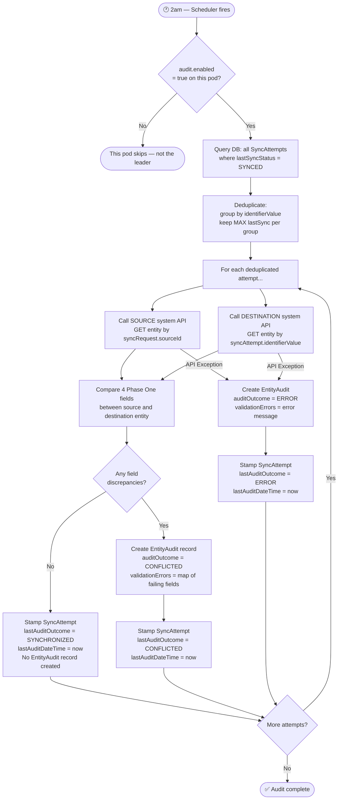
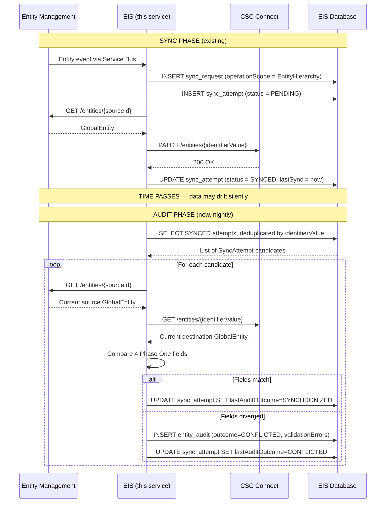

# Reconciliation Audit — Complete Business Understanding

---

## 1. The Business Problem

EIS syncs entity data between **Entity Management (EM)** and **CSC Connect**. Once synced, EIS has
**no live hook** to know if either system changes data independently. A CSR edits in CSC Connect. An
admin updates EM. The two systems silently drift apart with no one knowing.

**The reconciliation audit job is the nightly safety net** — it re-checks every previously-synced
entity to detect that drift.

> ⚠️ **This is DETECT & REPORT only — not re-sync.**
> Re-syncing drifted entities is explicitly a **future phase**.

---

## 2. Story AC Breakdown

---

### AC 1 — `eventType` field renamed to `operationScope` (enum)

**Business reason:** The word `eventType` was ambiguous — it mixed up "what triggered this event"
with "what scope of data was included in the sync". `operationScope` is clearer: it describes
**what data was included in the sync operation**.

| Old (free text string) | New (typed enum) |
|---|---|
| `eventType: "HIERARCHY_SYNC"` | `operationScope: EntityHierarchy` |

**Enum values and their meaning:**

| Value | What it means |
|---|---|
| `EntityHierarchy` | Full entity data — name, type, jurisdiction, status, etc. |
| `OfficerDirectorManagement` | Officers and directors data |
| `Service` | CSC service records |
| `Jurisdiction` | Jurisdiction formation info |
| `EntityName` | Just the legal name |

**Where it is stored:** `SyncRequest.operationScope` — stamped when the sync event first arrives,
either via Service Bus or the `/entitySync` HTTP endpoint.

---

### AC 2 — Scheduled task, runs every night

**Business reason:** Data drift is silent and accumulates over time. A nightly sweep catches it
within 24 hours of it happening, keeping the window of divergence small.

**How it works:**
- Spring `@Scheduled` cron job (e.g. `0 0 2 * * ?` = runs at 2am every night)
- No human trigger required — runs automatically as part of the application lifecycle

---

### AC 3 — Enabled by external config flag (one pod only)

**Business reason:** EIS runs as **multiple pods** in Azure Container Apps for high availability.
If all pods run the audit simultaneously at 2am:
- Every entity gets audited 3× — triple the external API calls
- Duplicate `EntityAudit` records are written to the DB
- Race conditions occur when updating `SyncAttempt` rows

**Solution:** An environment variable `audit.enabled=true` is set on **only one designated pod**.
The other pods have `audit.enabled=false` and the audit bean is never created on them.

```
Pod 1:  audit.enabled=true   → ✅ audit job runs at 2am
Pod 2:  audit.enabled=false  → ❌ audit bean not created, job never runs
Pod 3:  audit.enabled=false  → ❌ audit bean not created, job never runs
```

The platform/ops team is responsible for ensuring only one pod has this flag set to `true`.

---

### AC 4 — Examines every successfully linked entity

**Business reason:** Only `SYNCED` entities are auditable. If a sync previously failed
(`ERROR`/`FATAL`), the entity may not exist in the destination system — there is nothing to fetch
and compare.

**What "successfully linked" means:**

| `SyncAttempt.lastSyncStatus` | Included in audit? | Reason |
|---|---|---|
| `SYNCED` | ✅ Yes | Entity confirmed written to destination — can be fetched |
| `ERROR` | ❌ No | Sync failed — entity may not exist in destination |
| `FATAL` | ❌ No | All retries exhausted — same as above |
| `PENDING` | ❌ No | Sync not yet complete |

---

### AC 5 — Deduplication: most recently synced record used

**Business reason:** An entity can be synced many times over its lifetime — every time it is
updated in the source system, a new `SyncAttempt` row is created. For the audit we only care about
**the current state**, not historical snapshots.

**Rule:** Group all `SYNCED` attempts by `identifierValue`, keep only the one with the
**latest `lastSync` timestamp**.

**Example:**

```
identifierValue = "CSC-12345"
─────────────────────────────────────────────────────
SyncAttempt #1  lastSync = 2025-01-01  SYNCED   ← skip (older)
SyncAttempt #2  lastSync = 2025-06-01  SYNCED   ← ✅ USE THIS
SyncAttempt #3  lastSync = 2025-06-15  ERROR    ← skip (not SYNCED)
```

---

### AC 6 — Fetch live data from source AND destination, compare Phase One fields

**Business reason:** We fetch the **live current data** from both systems at audit time — not from
any local DB snapshot. This is the real drift check.

```
Audit job → call EM API   (GET entity by sourceId)         → source entity
Audit job → call CSC API  (GET entity by identifierValue)  → destination entity
Compare the Phase One fields between the two
```

#### Phase One Fields in Scope

| Field | Where on the entity | Why it matters |
|---|---|---|
| `jurisdictionOfFormation.formationDate` | Both source and destination entity | The legal formation date — authoritative in EM, must match in CSC Connect |
| `jurisdictionOfFormation.entityTypeCode` | Both source and destination entity | The entity type code used by the jurisdiction — must be consistent |
| `externalSystemIdentifiers[csc_connect].identifierValue` | Source EM entity's external ID list | The ID EM holds for this entity in CSC Connect — integrity check |
| `externalSystemIdentifiers[csc_connect].externalSystemCode` | Source EM entity's external ID list | The system code — should always be `csc_connect`, validated for integrity |

---

### AC 7 — If discrepancy found → create `EntityAudit` record

**Business reason:** A persistent, queryable audit trail. Operations and support teams can
investigate when drift started, which fields diverged, and prioritise re-sync work.

> `EntityAudit` is **only created when the outcome is `CONFLICTED` or `ERROR`**.
> A clean pass leaves no audit record — the database stays lean.

**What `EntityAudit` stores:**

| Field | Type | Description |
|---|---|---|
| `syncAttemptId` | FK | Which sync attempt was audited |
| `auditDateTime` | Timestamp | Exact moment the audit ran |
| `auditOutcome` | Enum | `CONFLICTED` or `ERROR` |
| `validationErrors` | JSON (TEXT) | Map of `{ "fieldName": "Expected X, found Y" }` |

**Example `validationErrors`:**
```json
{
  "jurisdictionOfFormation.formationDate": "Expected '2024-03-01', found '2024-04-15'",
  "jurisdictionOfFormation.entityTypeCode": "Expected 'LLC', found 'TRUST'"
}
```

---

### AC 8 — `SyncAttempt` gets two new columns

**Business reason:** Operations teams need a quick summary view of "when was this entity last
audited and did it pass?" without always having to join to the `EntityAudit` table. These columns
act as a **running summary stamp** on the attempt itself.

| New Column | Type | Description |
|---|---|---|
| `lastAuditDateTime` | Timestamp | When was this attempt most recently checked by the audit job |
| `lastAuditOutcome` | Enum | Result: `SYNCHRONIZED`, `CONFLICTED`, `ERROR`, or `UNKNOWN` |

> These columns are **updated on every audit run**, including clean passes.
> A new entity that has never been audited will have `lastAuditOutcome = UNKNOWN` (default).

**`AuditOutcome` enum values:**

| Value | Meaning |
|---|---|
| `SYNCHRONIZED` | Audited — all Phase One fields match across systems |
| `CONFLICTED` | Audited — one or more Phase One fields do not match |
| `ERROR` | Audit attempted but failed (API error, network issue) — consistency unknown |
| `UNKNOWN` | Not yet audited |

---

### AC 9 — `GET /api/auditReport` endpoint

**Business reason:** Ops teams and support staff need to inspect audit results without direct DB
access. This paginated API provides a filterable report combining data from both `SyncRequest` and
`SyncAttempt`.

**Available filters:**

| Filter | Default | Purpose |
|---|---|---|
| `beginDate` | One month ago | Start of date range on `createdDateTime` |
| `endDate` | Today | End of date range on `createdDateTime` |
| `sourceId` | — | Find all attempts for a specific entity |
| `operationScope` | — | Filter by what scope of data was synced |
| `lastAuditOutcome` | — | e.g. show only `CONFLICTED` records needing attention |
| `page` | 0 | Zero-based page index |
| `size` | 20 (max 100) | Records per page |

**`AuditReportEntry` fields returned (flattened view):**

| Field | Source table | Description |
|---|---|---|
| `correlationId` | `sync_request` | The originating event ID |
| `sourceId` | `sync_request` | Entity ID in source system |
| `sourceSystemCode` | `sync_request` | e.g. `entity_management` |
| `operationScope` | `sync_request` | What scope of data was synced |
| `createdDateTime` | `sync_request` | When the sync request was first received |
| `externalSystemCode` | `sync_attempt` | Destination system e.g. `csc_connect` |
| `identifierValue` | `sync_attempt` | Entity ID in destination system |
| `lastSync` | `sync_attempt` | When EIS last synced this entity |
| `lastAuditOutcome` | `sync_attempt` | Most recent audit result |

---

## 3. Complete Data Model — What Gets Stored

```
┌─────────────────────────────────────────────┐
│              sync_request                   │
├─────────────────────────────────────────────┤
│ id                   BIGINT (PK)            │
│ correlation_id       VARCHAR                │
│ source_id            VARCHAR  (entity ID)   │
│ source_system_code   VARCHAR                │
│ operation_scope      VARCHAR  ← renamed     │
│ created_date_time    TIMESTAMP              │
└─────────────────────┬───────────────────────┘
                      │ 1
                      │ N
┌─────────────────────▼───────────────────────┐
│              sync_attempt                   │
├─────────────────────────────────────────────┤
│ id                   BIGINT (PK)            │
│ sync_request_id      BIGINT (FK)            │
│ external_system_code VARCHAR                │
│ identifier_value     VARCHAR                │
│ portfolio_id         VARCHAR                │
│ last_sync            TIMESTAMP              │
│ last_sync_status     VARCHAR SYNCED/ERROR/… │
│ last_audit_date_time TIMESTAMP  ← NEW       │
│ last_audit_outcome   VARCHAR    ← NEW       │
└─────────────────────┬───────────────────────┘
                      │ 1
                      │   (only on CONFLICTED or ERROR)
                      │ N
┌─────────────────────▼───────────────────────┐
│              entity_audit          ← NEW    │
├─────────────────────────────────────────────┤
│ id                   BIGINT (PK)            │
│ sync_attempt_id      BIGINT (FK)            │
│ audit_date_time      TIMESTAMP              │
│ audit_outcome        VARCHAR                │
│ validation_errors    TEXT (JSON)            │
└─────────────────────────────────────────────┘
```

---

## 4. Nightly Job — Full Flow



---

## 5. Sequence Diagram — Full Entity Lifecycle



---

## 6. Key Business Rules Summary

| Rule | Detail |
|---|---|
| Only `SYNCED` attempts are audited | `ERROR`/`FATAL`/`PENDING` have nothing to compare in destination |
| One record per `identifierValue` | Latest `lastSync` wins — avoids auditing stale historical snapshots |
| `EntityAudit` only created on `CONFLICTED` or `ERROR` | Clean passes leave no audit record — DB stays lean |
| Both `SyncAttempt` columns updated on every run | A clean pass still stamps `SYNCHRONIZED` + timestamp |
| Audit does NOT re-sync | Detect and report only — re-sync is a future phase |
| One pod only | External `audit.enabled` flag prevents duplicate concurrent audit runs |
| Phase One fields fixed for this story | 4 fields in scope — more can be added in future stories |

---

## 7. Files Affected (Code Change Summary)

### New Files

| File | Purpose |
|---|---|
| `domain/AuditOutcome.java` | Enum: `SYNCHRONIZED`, `CONFLICTED`, `ERROR`, `UNKNOWN` |
| `domain/EntityAudit.java` | JPA entity for the new `entity_audit` table |
| `repository/EntityAuditRepository.java` | Spring Data repo for `EntityAudit` |
| `service/ReconciliationAuditService.java` | Scheduled job — the core audit logic |
| `service/PhaseOneFieldComparator.java` | Compares the 4 Phase One fields, returns error map |
| `controller/AuditReportController.java` | `GET /api/auditReport` endpoint |
| `model/AuditReportEntry.java` | Response DTO — flattened view of SyncAttempt + SyncRequest |
| `model/AuditReportPage.java` | Paginated wrapper for `AuditReportEntry` list |

### Modified Files

| File | Change |
|---|---|
| `domain/SyncRequest.java` | `eventType: String` → `operationScope: OperationScope` |
| `domain/SyncAttempt.java` | Add `lastAuditDateTime` and `lastAuditOutcome` columns |
| `model/EntitySyncRequest.java` | `eventType: String` → `operationScope: OperationScope` |
| `model/EntityEnvelope.java` | `eventType: String` → `operationScope: OperationScope` |
| `messaging/EntityStatusPublisher.java` | Use `request.getOperationScope()` directly (no more `valueOf`) |
| `repository/SyncAttemptRepository.java` | Add dedup query + `JpaSpecificationExecutor` for report filtering |
| `config/SecurityConfig.java` | Add `/api/auditReport` to allowed secured endpoints |
| `config/GeaRestClientFactory.java` | Add OAuth2 client-credentials fallback for `entity_management` (needed by audit job — no user Bearer token at 2am) |
| `EntityIntegrationApplication.java` | Add `@EnableScheduling` |
| `schema.sql` | Add 2 columns to `sync_attempt`; create new `entity_audit` table |
| `application.properties` | Add `audit.enabled=false` and `audit.cron` defaults |
| `application-local.properties` | Add `audit.enabled=true` for local dev testing |
