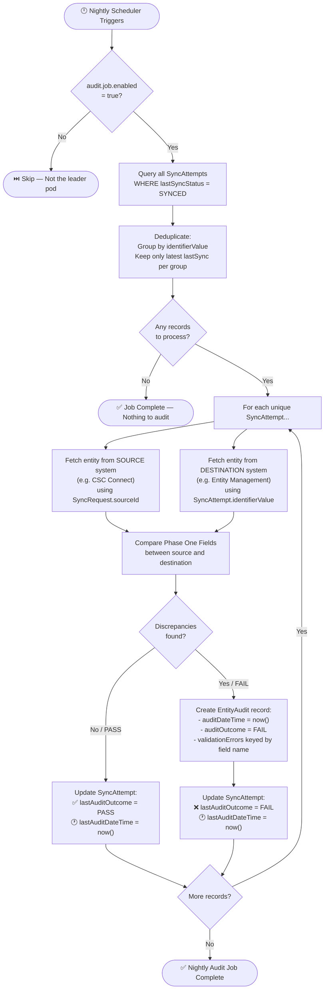
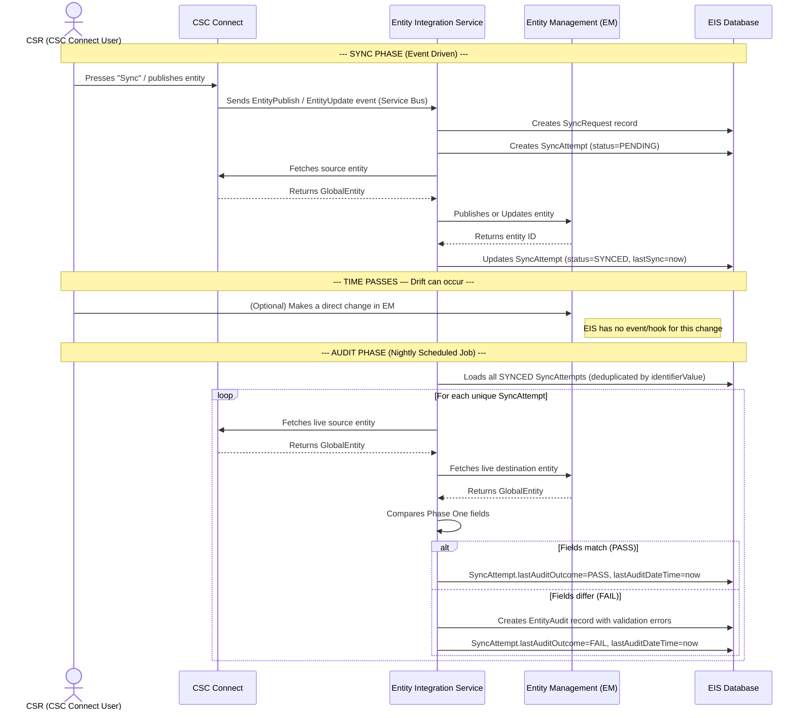
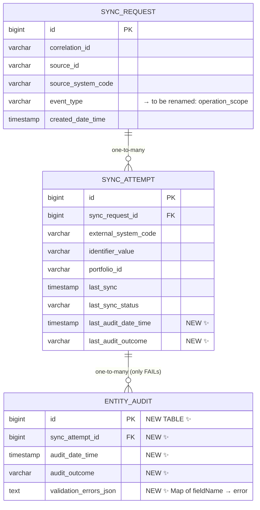
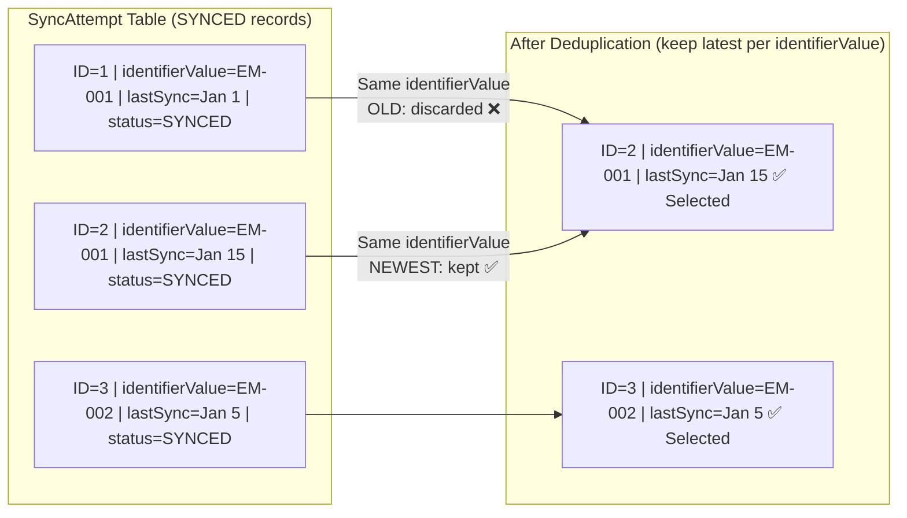

# Reconciliation Audit Job — Business Understanding

> **Source:** Rapid Grooming session transcript + codebase analysis  
> **Participants:** Nathan Quirk (Tech Lead), Keyur Rao Beeravally (BA), Corey McDaniel, Srinivasa Rao Burri, Anil Kumar Reddy Moku, and team

---

## 1. Why Does This Job Exist?

### The Core Problem — Data Drift

The Entity Integration Service (EIS) syncs entity data from a **source system (CSC Connect)** to a **destination system (Entity Management / EM)**. When a sync happens, it is manual — a CSR (Customer Service Representative) presses a button in CSC Connect to trigger it.

**The problem:** Two systems that were in sync at one point have no real-time link. After the sync:

- A user in **EM** could go in and change the formation date of an entity.
- A CSR in **CSC Connect** could update entity fields without triggering a re-sync.
- There is currently **no event/hook** from EM notifying EIS of changes.
- There is currently **no automated feedback mechanism** from CSC Connect either.

> **Nathan:** *"The whole point of the reconciliation, the audit, is because the two systems are not linked in real time. So a CSR working with the CSC Connect app could make an update to entities, and there's nothing stopping them from doing that."*

**Result:** Entities that were synced successfully at a point in time can become **drifted — out of sync** — without EIS knowing.

---

## 2. What Does the Job Do? (Plain English)

> **This is a DETECT-AND-REPORT job, NOT a re-sync job (for Phase 1).**

Every night, the job:
1. Looks at all entities that **EIS already successfully synced**.
2. Re-fetches the live data from both systems (CSC Connect and EM).
3. Compares a defined set of **Phase One fields**.
4. If differences are found → **records an `EntityAudit` failure record** and logs the exact field-level discrepancies.
5. Always stamps the `SyncAttempt` record with **when it was last audited** and **what the outcome was**.

> **Nathan:** *"We're not re-syncing anything. We're just letting the business know. For right now, we're just providing them with a report."*

---

## 3. What Is In Scope?

| Question | Answer |
|---|---|
| **What entities are checked?** | Only entities that have passed through **EIS** (i.e. have a `SyncAttempt` record). Not all entities in EM. |
| **Which sync attempts are used?** | Only `SyncAttempt` records with `lastSyncStatus = SYNCED`. |
| **What if an entity was synced multiple times?** | Use the **most recently synced** record (latest `lastSync` timestamp) per unique `identifierValue`. |
| **Is the job re-syncing data?** | **No.** Phase 1 is detect and report only. |
| **Which direction of drift is checked?** | Both — EM side changes AND CSC Connect side changes (any field divergence, regardless of who caused it). |
| **Which fields are compared?** | The **Phase One fields** (see Section 5). |
| **Is this a permanent solution?** | **No.** It's a stopgap until real-time event hooks exist between systems. |

> **Nathan:** *"The pool of potential entities is just the ones that have already been synced by EIS, by our service. We are not looking at all the entities in EM."*

---

## 4. Key Domain Concepts

### 4.1 SyncRequest
A record of the **incoming request** as received. Holds source-specific data.

| Field | Description |
|---|---|
| `sourceId` | The entity's ID in the source system (CSC Connect) |
| `sourceSystemCode` | The source system code (e.g., `csc_connect`) |
| `correlationId` | The incoming event ID |
| `eventType` | Type of operation (to be refined to `operationScope` per grooming) |
| `createdDateTime` | When the request was received |

### 4.2 SyncAttempt
A record **specific to the destination system** that tracks what happened to each sync operation. One `SyncRequest` can produce one or more `SyncAttempt` records (one per destination).

| Field | Description |
|---|---|
| `externalSystemCode` | Destination system code (e.g., `entity_management`) |
| `identifierValue` | The entity's ID in the **destination system** |
| `portfolioId` | Portfolio context |
| `lastSync` | When the entity was last synced |
| `lastSyncStatus` | `SYNCED` / `ERROR` / `FATAL` / `PENDING` |
| `lastAuditDateTime` | *(New)* When this sync attempt was last audited |
| `lastAuditOutcome` | *(New)* Result of the last audit: `PASS` or `FAIL` |

### 4.3 SyncStatus Values

| Status | Meaning |
|---|---|
| `SYNCED` | Sync completed successfully ✅ |
| `ERROR` | Failed with a non-retryable HTTP error (e.g. 4xx) |
| `FATAL` | All retries exhausted |
| `PENDING` | In progress, not yet completed |

### 4.4 EntityAudit (New)
A new record created **only when drift (discrepancy) is found**. A successful audit produces no `EntityAudit` record — only the `SyncAttempt` is stamped.

| Field | Description |
|---|---|
| `syncAttemptId` | Reference to the `SyncAttempt` that was audited |
| `auditDateTime` | Timestamp of when the audit occurred |
| `auditOutcome` | `FAIL` (only created on failure) |
| `validationErrors` | Map of `fieldName → error description` e.g. `{"legalName": "Expected 'Acme Corp', found 'Acme Inc'"}` |

> **Nathan:** *"We don't necessarily need to create an entity audit record for entities that are in sync still."*  
> **Decision (group agreement):** EntityAudit record is created **only on FAIL**. On PASS, only the `SyncAttempt.lastAuditDateTime` and `lastAuditOutcome` are updated.

---

## 5. Phase One Fields (Comparison Fields)

These are the fields on `GlobalEntity` that EIS is responsible for keeping consistent between CSC Connect and Entity Management:

| Field | Description |
|---|---|
| `legalName` | Registered legal name of the entity |
| `entityStatus` | Current status of the entity |
| `entityType` | Type of entity (e.g. LLC, Trust) |
| `jurisdictionOfFormation` | Country code, jurisdiction code, entity type code, formation date |
| `fiscalYearEnd` | Company's fiscal year end (MM-DD format) |
| `businessPurpose` | Purpose/objective of the entity |
| `consentCode` | Data processing consent code (Full / Partial / No) |
| `entityPrincipalActivity` | Principal business activity |
| `cscServicedFlag` | Whether the entity is serviced by CSC |
| `subStatus` | Current sub-status |

> ⚠️ Exact Phase One field list to be confirmed with the product team. The above are candidates from the `GlobalEntity` model.

---

## 6. The Three Sync Operations (Context)

Understanding the sync operations helps clarify what the audit is validating:

| Operation | Description |
|---|---|
| **Publish** | A new entity exists in CSC Connect but not yet in EM → EIS publishes it to EM |
| **Link** | An entity exists in both systems but is not yet connected → EIS links them via `externalSystemIdentifiers` |
| **Update** | Entity already linked → EIS pushes updated fields from CSC Connect to EM |

> After any of these, a `SyncAttempt` with `SYNCED` status is created. The audit job later checks if those synced entities have drifted.

---

## 7. Important Design Decision — The `operationScope` Discussion

During grooming, the team discussed an important refinement:

**Problem raised (Corey):** If both a full entity sync and a name-change sync have been done for the same entity, how do we deduplicate `SyncAttempt` records for the audit job?

**Nathan's resolution:**
- The `eventType` field on `SyncRequest` should be renamed/refined to `operationScope`.
- `operationScope` captures **what part of the entity** was synced (e.g., `ENTITY`, `NAME`, `APPOINTMENT`, etc.).
- The `identifierValue` in `SyncAttempt` points to the **resource ID in the destination** — for entity syncs it's the entity ID, for name syncs it's the name record ID.
- Since each operation scope results in different `identifierValue`s, deduplication by `identifierValue` (keeping most recent per value) is valid **for Phase 1**.

> **Nathan:** *"Find all sync attempts which have a last sync status of SYNCED, unique identifier value. If there are multiple, we select the one that was synced most recently."*

---

## 8. Cluster Safety — Single Pod Execution

The nightly job must execute **on exactly one pod** in a multi-pod deployment (since EIS runs multiple instances for HA). This is controlled via an **external configuration flag** (e.g., `audit.job.enabled=true`), which is set to `true` only for the leader pod.

---

## 9. Future Vision (Out of Scope for Phase 1)

| Feature | Status |
|---|---|
| Auto re-sync drifted entities | 🔮 Future — the audit data will feed this |
| Real-time hooks/events from EM on entity changes | 🔮 Future — will reduce the need for full nightly scans |
| Real-time hooks from CSC Connect for all update scenarios | 🔮 Future — CSC Connect doesn't yet have logic for all update scenarios |
| Bi-directional entity reconciliation | 🔮 Future — currently only CSC Connect → EM direction |

> **Nathan:** *"Eventually this is going to be used for that. Eventually we want to take entities that have drifted away and resync them."*

---

## 10. Flowcharts

### 10.1 High-Level Nightly Reconciliation Job Flow



---

### 10.2 Entity Lifecycle — From Sync to Audit



---

### 10.3 Data Model — Current vs. After Story



---

### 10.4 Deduplication Logic — Why We Need It



> **Reason:** The most recently synced record reflects the last known-good state of the entity in the destination. Comparing against an older snapshot would produce false negatives.

---

### 10.5 Drift Scenario — Why the Audit Catches What the Sync Doesn't

```mermaid
timeline
    title Entity Lifecycle with Drift

    section Sync Event (Jan 1)
        CSC Connect has legalName = "Acme Corp"
        EIS syncs it to EM
        EM now has legalName = "Acme Corp"
        SyncAttempt status = SYNCED ✅

    section Post-Sync Drift (Jan 10)
        A user in EM directly edits legalName to "Acme Inc"
        EIS receives NO event about this change
        Two systems are now OUT OF SYNC silently

    section Nightly Audit (Jan 11 ~2am)
        Job fetches CSC Connect → legalName = "Acme Corp"
        Job fetches EM → legalName = "Acme Inc"
        MISMATCH DETECTED ❌
        EntityAudit created with validationErrors = {legalName":"Expected 'Acme Corp' found 'Acme Inc'"}
        SyncAttempt.lastAuditOutcome = FAIL
```

---

## 11. Summary — What Changes Need to Be Built

| Artifact | Change Type | Description |
|---|---|---|
| `SyncAttempt` entity + table | ✏️ Modify | Add `lastAuditDateTime` and `lastAuditOutcome` columns |
| `SyncRequest` entity | ✏️ Modify | Rename/add `operationScope` field (in addition to / replacing `eventType`) |
| `EntityAudit` entity + table | 🆕 New | New domain entity for storing field-level audit failures |
| `EntityAuditRepository` | 🆕 New | Spring Data JPA repository for `EntityAudit` |
| `ReconciliationAuditService` | 🆕 New | Core service that performs the field comparison logic |
| `ReconciliationAuditJob` | 🆕 New | `@Scheduled` task that drives the nightly process |
| `audit.job.enabled` config flag | 🆕 New | External property to control single-pod execution |
| Phase One field comparator | 🆕 New | Logic to compare specific fields between two `GlobalEntity` instances |
| `schema.sql` | ✏️ Modify | Add new columns to `sync_attempt`, create `entity_audit` table |

---

## 12. Key Decisions Made in Grooming

| # | Decision | Outcome |
|---|---|---|
| 1 | Should `EntityAudit` be created for PASS audits too? | **No** — only create on FAIL. Update `SyncAttempt` for both outcomes. |
| 2 | Do we re-sync drifted entities in Phase 1? | **No** — detect and report only. Re-sync is future scope. |
| 3 | How to deduplicate sync attempts? | Group by `identifierValue`, take latest `lastSync` |
| 4 | Should `lastAuditOutcome` on `SyncAttempt` be separate from `EntityAudit`? | **Yes** — `SyncAttempt` gets quick-access columns; full details are in `EntityAudit` |
| 5 | Scope of entities to audit | **Only entities that have been synced by EIS** — not all entities in EM |
| 6 | Is this a stopgap? | **Yes** — temporary until event hooks from EM/CSC Connect are built |

